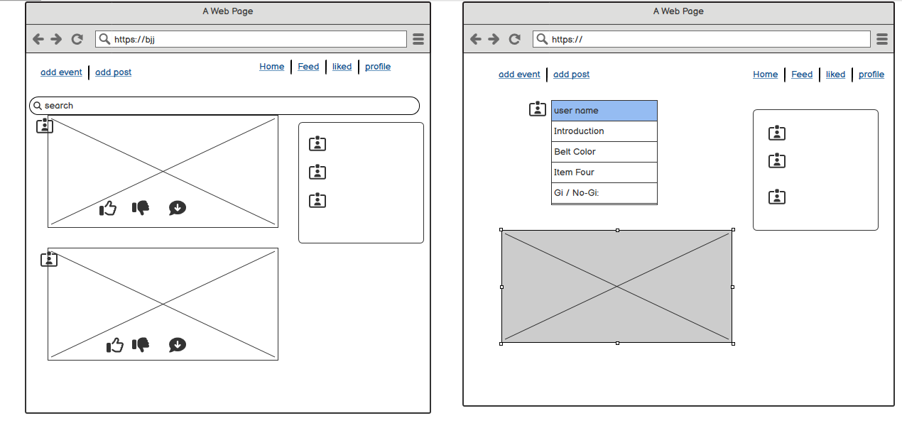

**_BJJconnect - Project Portfolio 5 - Advanced Front End (React)_**

Bjj connect is developed and submitted as my fifth Profile Portfolio Project as part of the Advanced Frontend specialization for Code Institute's Diploma in full-stack software development. The website is used by a fictional online community of BJJ(Brazilian jiu-jitsu) to share memories and events scheduled for the future.

You can view the live site here - <a href="https://bjj-fcb7bcc1efc9.herokuapp.com/" target="_blank" rel="noopener">Bjj Connect</a>

You can view the live API here - <a href="https://pp5-bjj-api-2269f4220822.herokuapp.com/" target="_blank" rel="noopener">BJJ API</a>

You can view the front-end README.md here - <a href="" target="_blank" rel="noopener"> Front-End README</a>

You can view the back-end README.md here - <a href="" target="_blank" rel="noopener"> Back-End README</a>

# Contents

## Contents

 - **[User Stories](#user-stories)**
   
 - **[UX and UI Design](#ux-and-ui-design)**

 - **[Agile Development Process](#agile-development-process)**

- **[Typography](#typography)**

- **[Main Features](#main-features)**

- **[Features for the future](#features-for-the-future)**

- **[Testing](#testing)**

- **[Deployment](#deployment)**

- **[Technologies used](#technologies-used)**

 - **[Credits](#credits)**

   ## [**User Stories**](#user-stories)

   **Navigation and authentication**

    - Navigation: As a user I can view a navbar from every page so that I can navigate easily between pages

    - Routing: As a user I can navigate through pages quickly so that I can view content seamlessly without page refresh

    - Authentication - Sign up: As a user I can create a new account so that I can access all the features for signed up users

    - Authentication - Sign in: As a user I can sign in to the app so that I can access functionality for logged in users

    - Authentication - Logged in Status: As a user I can tell if I am logged in or not so that I can log in if I need to

    - Authentication - Refreshing access tokens: As a user I can maintain my logged-in status until I choose to log out so that my user experience is not compromised

    - Navigation: Conditional rendering - As a logged-out user I can see sign in and sign-up options so that I can sign in/sign up

    - Avatar: As a user I can view user's avatars so that I can easily identify users of the application

    **Profile**

    - Profile page: As a user I can view other users’ profiles so that I can see their posts and learn more about them
    - Most followed profiles: As a user I can see a list of the most followed profiles so that I can see which profiles are popular
    - As a user I can view data about other users, such as the number of posts,number of events shared, follows and users followed Club Name,Introduction,Belt Color,Gi / NoGi and Years 
      Trained so that I can learn more about them.
    - Follow/Unfollow a user: As a logged in user, I can follow and unfollow other users so that I can see and remove posts by specific users in my posts feed
    - View all posts by a specific user: As a user I can view all the posts by a specific user so that I can catch up on their latest posts, or decide I want to follow them
    - Update user details: As a logged in user, I can update myaccount name  Club Name,Introduction, Belt Color,Gi / NoGi and Years Trained  keep my profile up to date.
    - Update username and password: As a logged in user, I can update my username,password that I can change my display name and keep my profile secure

    **Post and event like,dislike and commenting** 
    
    -  Create posts/events : As a logged in user, I can create posts and events with images.
    -  combine posts and events: As a user I can view the posts/and events based on the time they are created to be up to date with what is lates 
    -  View a post/event: As a user I can view the details of a single post/event so that I can learn more about it
    -  Like a post/event: As a logged in user, I can like a post/event so that I can show my interest in the post/event.
    -  DisLike a post/event: As a logged in user, I can dislike a post/event so that I can show i am not interest in the post/event.
    -  Post/event page: As a user I can view the posts page so that I can read the comments about the post
    -  Edit post/event: As a post owner I can edit my post and event details so that I can update my post/event after it was created
    -  Create a comment: As a logged in user, I can add comments to a post/event so that I can share my thoughts about the post
    -  Comment date: As a user I can see how long ago a comment was made so that I know how old a comment is
    -  View comments: As a user I can read comments on posts so that I can read what other users think about the post or event
    -  Delete comments: As an owner of a comment, I can delete my comment so that I can control removal of my comment from the application
    -  Edit a comment: As an owner of a comment, I can edit my comment so that I can fix or update my existing comment
  
 
  ## **[UX and UI Design](#ux-and-ui-design)**

   ### **UX Design**

   The UX design process involved creating 2 wire frame pages , the home page and  the profile page. 

  ### **UI Design**
   
   Given the nature of the project being a social platform, it was paramount that the aesthetic served a range purposes. The main priority is :

   - **Readability and Accessibility**:  The use of a white background (#ffffff) is a classic choice that provides a clean and uncluttered canvas. This high-contrast background is beneficial for readability as it makes text and other elements stand out clearly while the consistent use of Roboto Condensed makes it easier to read at various sizes and resolutions.

   - **Feedback and Interactivity**: the standard expectations of today's users around UI had to be considered. This project attempts to use these taken-for-granted expectations to maximise the impact of basic features on the user, such as changing the color of a button when it's hovered over or clicked.
Often, websites opt for more subtle and subdued shifts between colors to notify users of any data changes happening and to provide real-time feedback to users. SpoodleSapce uses both subtle color themes familiar to users and then loud unexpected strong contrasting colors to achieve a more intense and enhanced UI depending on the context. 

   - **Consistency Across Components**: the styling defined in each of the separate CSS modules reuses a color scheme that can be efficiently applied to the different components as needed, ensuring a consistent look and feel.

   **Color Scheme**

   The main colors applied throughout the project are:
  - `#f8f8f8`
  - `#ffffff`
  - `#525252`
  - `#013af7`
  - `#cfced3`
  - `#2142b2`
  - `#f1f1f1`
  - `#888`
  - `#555`
These colors are used for background colors, text colors, and border colors.

The front-end library chosen for the project was [React Bootstrap](https://github.com/react-bootstrap/react-bootstrap) to combine the component-based approach of React with the styling and design principles of Bootstrap. The advantage of this decision was directly linked to the tight timeframe for delivering a MVP. Its 'out of the box' components and pre-built styles removed a significant amount of the time and energy required. Other advantages of its key features for this project include:

- React Components: It provides React-compatible versions of Bootstrap components, allowing developers to use them in their React applications seamlessly.

- Responsive Design: React Bootstrap components are designed to be responsive, adapting to different screen sizes and devices.

- Customization: While React Bootstrap provides ready-to-use components, developers can still customize and extend these components to meet the specific requirements of their applications.

- Integration: React Bootstrap can be easily integrated into existing React projects. Developers can import individual components or the entire library based on their needs.

- Maintained and Updated: React Bootstrap is actively maintained and updated to align with the latest versions of React and Bootstrap.

### [**Agile Development Process**](#agile-development-process)

  - Github Projects was used to structure the workflow. 
  - View the Project on Github [**Here**](https://github.com/users/Awsomenesss/projects/19)
