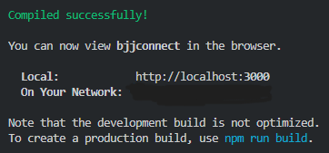
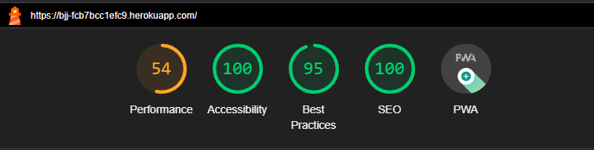
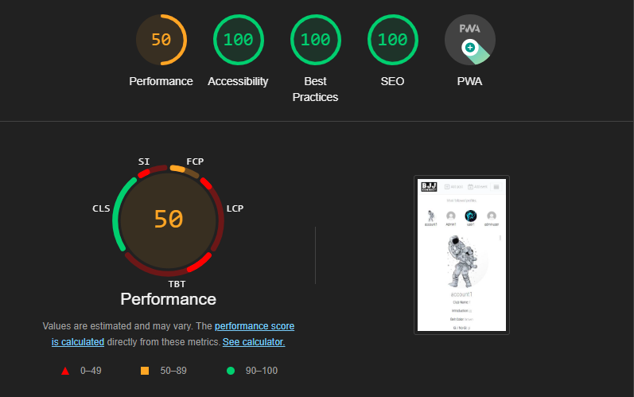
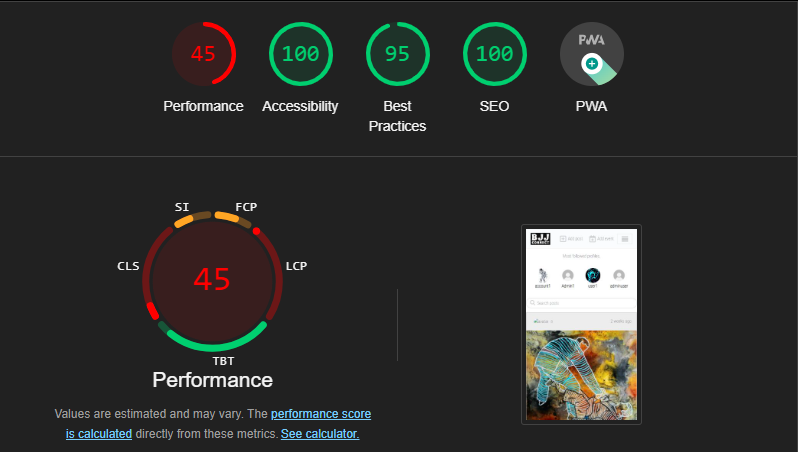

## BJJconnect ## 

**_Project Portfolio 5 - Advanced Front End (React)_**

Bjj connect is developed and submitted as my fifth Profile Portfolio Project as part of the Advanced Frontend specialization for Code Institute's Diploma in full-stack software development. The website is used by a fictional online community of BJJ(Brazilian jiu-jitsu) to share memories and events scheduled for the future.

You can view the live site here - <a href="https://bjj-fcb7bcc1efc9.herokuapp.com/" target="_blank" rel="noopener">Bjj Connect</a>

You can view the live API here - <a href="https://pp5-bjj-api-2269f4220822.herokuapp.com/" target="_blank" rel="noopener">BJJ API</a>

You can view the front-end README.md here - <a href="https://github.com/Awsomenesss/bjjreact_app/edit/main/README.md" target="_blank" rel="noopener"> Front-End README</a>

You can view the back-end README.md here - <a href="https://github.com/Awsomenesss/pp5_api/blob/main/README.md" target="_blank" rel="noopener"> Back-End README</a>

# Contents

## Contents

 - **[User Stories](#user-stories)**
   
 - **[UX and UI Design](#ux-and-ui-design)**

 - **[Agile Development Process](#agile-development-process)**

- **[Typography](#typography)**

- **[Main Features](#main-features)**

- **[Features for the future](#features-for-the-future)**

- **[Testing](#testing)**

- **[Deployment](#deployment)**

- **[Technologies used](#technologies-used)**

 - **[Credits](#credits)**

   ## [**User Stories**](#user-stories)

   **Navigation and authentication**

    - Navigation: As a user I can view a navbar from every page so that I can navigate easily between pages

    - Routing: As a user I can navigate through pages quickly so that I can view content seamlessly without page refresh

    - Authentication - Sign up: As a user I can create a new account so that I can access all the features for signed up users

    - Authentication - Sign in: As a user I can sign in to the app so that I can access functionality for logged in users

    - Authentication - Logged in Status: As a user I can tell if I am logged in or not so that I can log in if I need to

    - Authentication - Refreshing access tokens: As a user I can maintain my logged-in status until I choose to log out so that my user experience is not compromised

    - Navigation: Conditional rendering - As a logged-out user I can see sign in and sign-up options so that I can sign in/sign up

    - Avatar: As a user I can view user's avatars so that I can easily identify users of the application

    **Profile**

    - Profile page: As a user I can view other users’ profiles so that I can see their posts and learn more about them
    - Most followed profiles: As a user I can see a list of the most followed profiles so that I can see which profiles are popular
    - As a user I can view data about other users, such as the number of posts,number of events shared, follows and users followed Club Name,Introduction,Belt Color,Gi / NoGi and Years 
      Trained so that I can learn more about them.
    - Follow/Unfollow a user: As a logged in user, I can follow and unfollow other users so that I can see and remove posts by specific users in my posts feed
    - View all posts by a specific user: As a user I can view all the posts by a specific user so that I can catch up on their latest posts, or decide I want to follow them
    - Update user details: As a logged in user, I can update myaccount name  Club Name,Introduction, Belt Color,Gi / NoGi and Years Trained  keep my profile up to date.
    - Update username and password: As a logged in user, I can update my username,password that I can change my display name and keep my profile secure

    **Post and event like,dislike and commenting** 
    
    -  Create posts/events : As a logged in user, I can create posts and events with images.
    -  combine posts and events: As a user I can view the posts/and events based on the time they are created to be up to date with what is lates 
    -  View a post/event: As a user I can view the details of a single post/event so that I can learn more about it
    -  Like a post/event: As a logged in user, I can like a post/event so that I can show my interest in the post/event.
    -  DisLike a post/event: As a logged in user, I can dislike a post/event so that I can show i am not interest in the post/event.
    -  Post/event page: As a user I can view the posts page so that I can read the comments about the post
    -  Edit post/event: As a post owner I can edit my post and event details so that I can update my post/event after it was created
    -  Create a comment: As a logged in user, I can add comments to a post/event so that I can share my thoughts about the post
    -  Comment date: As a user I can see how long ago a comment was made so that I know how old a comment is
    -  View comments: As a user I can read comments on posts so that I can read what other users think about the post or event
    -  Delete comments: As an owner of a comment, I can delete my comment so that I can control removal of my comment from the application
    -  Edit a comment: As an owner of a comment, I can edit my comment so that I can fix or update my existing comment
  
 
  ## **[UX and UI Design](#ux-and-ui-design)**

   ### **UX Design**

   The UX design process involved creating 2 wire frame pages , the home page and  the profile page. 

  ### **UI Design**
   
   Given the nature of the project being a social platform, it was paramount that the aesthetic served a range purposes. The main priority is :

   - **Readability and Accessibility**:  The use of a white background (#ffffff) is a classic choice that provides a clean and uncluttered canvas. This high-contrast background is beneficial for readability as it makes text and other elements stand out clearly while the consistent use of Roboto Condensed makes it easier to read at various sizes and resolutions.

   - **Feedback and Interactivity**: the standard expectations of today's users around UI had to be considered. This project attempts to use these taken-for-granted expectations to maximise the impact of basic features on the user, such as changing the color of a button when it's hovered over or clicked.
Often, websites opt for more subtle and subdued shifts between colors to notify users of any data changes happening and to provide real-time feedback to users. SpoodleSapce uses both subtle color themes familiar to users and then loud unexpected strong contrasting colors to achieve a more intense and enhanced UI depending on the context. 

   - **Consistency Across Components**: the styling defined in each of the separate CSS modules reuses a color scheme that can be efficiently applied to the different components as needed, ensuring a consistent look and feel.

   **Color Scheme**

   The main colors applied throughout the project are:
  - `#f8f8f8`
  - `#ffffff`
  - `#525252`
  - `#013af7`
  - `#cfced3`
  - `#2142b2`
  - `#f1f1f1`
  - `#888`
  - `#555`
These colors are used for background colors, text colors, and border colors.

The front-end library chosen for the project was [React Bootstrap](https://github.com/react-bootstrap/react-bootstrap) to combine the component-based approach of React with the styling and design principles of Bootstrap. The advantage of this decision was directly linked to the tight timeframe for delivering a MVP. Its 'out of the box' components and pre-built styles removed a significant amount of the time and energy required. Other advantages of its key features for this project include:

- React Components: It provides React-compatible versions of Bootstrap components, allowing developers to use them in their React applications seamlessly.

- Responsive Design: React Bootstrap components are designed to be responsive, adapting to different screen sizes and devices.

- Customization: While React Bootstrap provides ready-to-use components, developers can still customize and extend these components to meet the specific requirements of their applications.

- Integration: React Bootstrap can be easily integrated into existing React projects. Developers can import individual components or the entire library based on their needs.

- Maintained and Updated: React Bootstrap is actively maintained and updated to align with the latest versions of React and Bootstrap.

### [**Agile Development Process**](#agile-development-process)

  - Github Projects was used to structure the workflow. 
  - View the Project on Github [**Here**](https://github.com/users/Awsomenesss/projects/19)

To achieve the site goals outlined in the User Stories section above, the development process was divided into sprints with three categories using the MoSCoW method. This helped prioritize the implementation of features based on their importance.

- **Must Have**

  - User Authentication: Users can create an account, sign in, and sign out.
  - User Profiles: CRUD functionality for users to personalize their presence on the website through profile pages.
  - Followers Feed: Users can view a list of posts by other users they are following. The logic for this feature can be found in the `utils.js`, `ProfileDataContext.js`, and `ProfilePage.js` files.
  - Liked Feed: Users can view a feed of posts they have liked. This feature is implemented in the `Navbar.js` component.
  - Image Posts: Users can create, read, update, and delete posts with images, titles, and descriptions.
  - Custom Models and Forms: Three custom models and corresponding forms with CRUD functionalities that are relevant to the site goal.
  - README.md files for the frontend and backend repositories.
  - Testing

- **Should Have**

  - Infinite Scroll: Implementing infinite scroll functionality for an improved user experience.
  - Search Bars: Users can search for posts and navigate to pages related to the three custom models and forms.

- **Could Have**

   - Online Resources: A feature that provides users with access to relevant websites and a list of online resources related to the site goal.

- **Would Have**

    - Add functionality to upload video to posts.
    - events to be location specific
 
### [**Typography**](#typography)

- The main font-family used throughout the project was "Roboto Condensed", "sans-serif". 

- These fonts were chosen for their well-defined letterforms, making it easier for users to read content and the limited use of fontes allow consistency in typography across the app. 

### [**Main Features**](#main-features)

 - Each of the features and goals for every User Stories outlined in detail above were implemented.

 - The React library provided menu of reusable components that were vital to allowing me using specific element across multiple features on the frontend on the project. These invaluable components saved me an immeasurable amount of time. I either customized or relied heavily on the following to meet the site goal:

    - Assets.js
    - Avatar.js
    - MoreDropDown.js
    - ProfileEditDropdown.js
    - Navbar.js 
    - NotFound.js
 **Asset.js**

    This component can display an image, a spinner, and/or a message to the user depending on the circumstances. It accepts the following props:

    - `spinner`: A boolean indicating whether to display a spinner animation.
    - `src`: The source URL of an image.
    - `message`: A message to display.

    **Avatar.js**

      This component is used to display the user's personalised avatar with an image they are able to choose. It accepts the following props:

      - `src`: The source URL of the avatar image.
      - `height`: The height of the avatar image.
      - `text`: Text to overlay on the avatar.

    **MoreDropdown.js**

      This component represents a dropdown menu with options for the user to edit and delete details as needed. It uses Bootstrap's Dropdown component and accepts two callback functions:

      - `handleEdit`: A callback function for the edit action.
      - `handleDelete`: A callback function for the delete action.

      **ProfileEditDropdown.js**

      Similar to `MoreDropdown`, this component allows the user to use a dropdown menu with options for editing their profile. It accepts the `id` of the profile to determine where to redirect for editing.

      **NavBar.js**

      This component provides navigation links and icons based on whether a user is logged in or not. It includes features such as sign out and dynamic icons based on a user's authentication status.

      **NotFound.js**

      This component is used to display a "Not Found" message along with an image when a user tries to access a non-existent page. It uses the `Asset` component to display the image and message.

### [**Features for the future**](#features-for-the-future)

  Features planned for future implementation are:

   - modify the like and feed to include events alongside posts
   - Functionality for eventes to be location specific

### [**Testing**](#testing)

  - ### Code Validation

  

   - ###Lighthouse Testing**
 This project has undergone development with a primary focus on functionality and features. While it delivers the intended functionality, it's important to note that the current version have performance issues that result in lower Lighthouse scores and slower load times.

the low score is consistent across all pages the below shows the lighthouse score accros the main pages. Optimization will be carried out after the assessment  

- ## Responsiveness Testing

  I've responsive testing for all pages for the following devices.

  - iPhone SE
  - iPhone 12 Pro
  - Pixel 5
  - iPad Air
  - iPad Mini
  - Surface Pro 7
  - Surface Duo
  - Galaxy Fold

 
 Upon initial responsive testing, I did find some minor alignment and size issues which have been documented in the Bugs Found section but they have now been rectified and the website is responsive on all the above devices
      
- ## Manual Testing Pages

| Page                 | Expected Result                                                                                                   | Pass/Fail |
| -------------------- | ----------------------------------------------------------------------------------------------------------------- | --------- |
| Homepage             | Loading the website renders the both the posts and eventes  page                                                  | Pass      |
| Homepage             | The navigation and the footer components don't load                                                               | Pass      |
| Homepage             | Hovering over the continue button turns the button blue                                                           | Pass      |
| Homepage             | Clicking the continue button navigates the user to the home page                                                  | Pass      |
| Home                 | The navigation bar is displayed to the user and all functionality works as per the navigation manual tests        | Pass      |
| Home                 | The role icons are displayed to the user and all functionality works as per the role icon manual tests            | Pass      |
| Home                 | The posts/events cards are displayed to the user and all functionality works as per the role icon manual tests    | Pass      |
| posts page           | can edit post fields details displayed to the user                                                                | Pass      |
| Events Page          | can edit event  fields details is displayed to the user                                                           | Pass      |
| profile page         | can edit user profile feild details                                                                               | Pass      |
| post/event pages     | The edit champion icon is only displayed to staff members only                                                    | Pass      |
| Champion Page        | Clicking the edit champion icon loads the ChampionEdit component with the correct data                            | Pass      |
| Sign In Page         | Clicking the username input box allows the user to input alphanumeric characters                                  | Pass      |
| Sign In Page         | Clicking the password input box allows the user to input alphanumeric characters                                  | Pass      |
| Sign In Page         | Clicking the sign in button will sign the user in if correct credentials have been entered                        | Pass      |
| Sign In Page         | Clicking the sign in button will not sign the user in if incorrect credentials have been entered                  | Pass      |
| Sign In Page         | Clicking the "sign up" text will navigate the user to the sign up page                                            | Pass      |
| Sign Up Page         | Clicking the username input box allows the user to input alphanumeric characters                                  | Pass      |
| Sign Up Page         | Clicking the password input box allows the user to input alphanumeric characters                                  | Pass      |
| Sign Up Page         | Clicking the confirm password input box allows the user to input alphanumeric characters                          | Pass      |
| Sign Up Page         | Clicking the sign up button will sign the user up if correct credentials have been entered                        | Pass      |
| Sign Up Page         | Clicking the "sign in" text will navigate the user to the sign in page                                            | Pass      |
| Profile Page         | Clicking the profile avatar image will allow the user to select a new image for their profile avatar              | Pass      |
| Profile Page         | Selecting a new image for the profile avatar will render the save button                                          | Pass      |
| Profile Page         | Clicking the save button on the profile avatar will deal with the image update request to the API                 | Pass      |
| posts page           | can create and change post fields details displayed to the user before submiting                                  | Pass      |
| Events Page          | can create and change event fields details displayed to the user before submiting                                 | Pass      |

 

- ## Manual Testing Features (Avatar, Login User, Likes, Dislikes, User Posts/Events)

| Feature            | Expected Result                                                                                           | Pass/Fail |
| ------------------ | --------------------------------------------------------------------------------------------------------- | --------- |
| Navigation         | The logo appears on the left-hand side                                                                   |   Pass    |
| Navigation         | The logo redirects the user to the /home page when clicked                                               |   Pass    |
| Navigation         | The search bar is positioned in the middle below navigation bar                                         |   Pass    |
| Navigation         | The avatar icon appears on the right-hand side                                                           |   Pass    |
| Navigation         | When the user is logged out, avatar is not  rendered                                                     |   Pass    |
| Navigation         | When the user is logged in, the user's profile avatar is rendered                                         |   Pass    |
| Navigation         | When the user is logged out, clicking the "Sign In" and "Sign Up" options can either log in or log out    |   Pass    |
| Navigation         | If a logged out user clicks "About," it redirects the user to the  page                        |   Pass    |
| Navigation         | If a logged out user clicks "Sign Up," it redirects the user to the /signup page                         |   Pass    |
| Navigation         | If a logged out user clicks "Sign In," it redirects the user to the /signin page                         |   Pass    |
| Navigation         | If a logged in user clicks "Home," it redirects the user to the /home page                                |   Pass    |
| Navigation         | If a logged in user clicks "Profile," it redirects the user to the /profile/{profile_id} page             |   Pass    |
| Navigation         | If a logged in user clicks "Feed," it redirects the user to the feed page showing posts/events they liked |   Pass    |
| Navigation         | If a logged in user clicks "Liked," it redirects the user to the liked posts page                         |   Pass    |
| Navigation         | If a logged in user clicks "Log Out," it redirects the user to the /home page and logs the user out        |   Pass    |
| User Avatar        | Clicking the user avatar redirects the user to their profile page                                        |   Pass    |
| Post/Event Card    | The post/event card contains the post/event title                                                         |   Pass    |
| Post/Event Card    | The post/event card contains the post/event content                                                       |   Pass    |
| Likes and Dislikes | As a logged out user, clicking the like and dislike buttons for posts and events do not register likes or dislikes |   Pass |
| Likes and Dislikes | As a logged in user, clicking the like button for a post/event changes the button color to red and registers the like |   Pass |
| Likes and Dislikes | As a logged in user, clicking the dislike button for a post/event changes the button color to red and registers the dislike |   Pass |
| Likes and Dislikes | Users cannot like and dislike the same post/event                                                                          | Pass |
| Likes and Dislikes | Clicking the like button again for a post/event removes the like                                                           | Pass |
| Likes and Dislikes | Clicking the dislike button again for a post/event removes the dislike                                                      | Pass |
| User Posts/Events  | As a logged in user, creating a post/event redirects the user to the newly created card                                     | Pass |
| User Posts/Events  | As a logged in user, the user's posts/events are displayed on their profile page                                            | Pass |

  

 ### [**Deployment**](#deployment)

Heroku was used to deploy this project by the following these steps:

1. Create or log in to your account on [Heroku.com](https://www.heroku.com/)
2. Click "New" and select "Create new app", then add a unique app name and choose your region
3. Click on create app
4. Push your changes to GitHub
5. Push the code to Heroku using the command git push Heroku main
6. Log in to heroku.com and open the dashboard for your React application (this is separate from the Django Rest Framework application that runs the API). In settings, make sure that the 'Config Vars' match the env.py file and that DEBUG and DEVELOPMENT are set correctly. 
7. Before Selecting the “Deploy” tab in the dashboard, add 'Python' to the 'buildpack' if not already present. 
8. Connect to Github, the relevant repository and choose the correct branch before clicking on “Deploy Branch”
9. When you see the message “deployed to Heroku” in the build log, click the “open app” button at the top of the page.

### [**Technologies used**](#technologies-used)
  
  - **Languages**

    - HTML
    - CSS
    - JavaScript

  
  - **Libraries, frameworks and dependencies**

    - [React](https://reactjs.org/) was the core library used for building this website.

    - [React Router](https://v5.reactrouter.com/web/guides/philosophy)  handled the navigation between views and components.

    - [React Infinite Scroll](https://www.npmjs.com/package/react-infinite-scroll-component) was used for to load content as the user scrolls down the page.

    - [Axios](https://axios-http.com/) is used here to make the HTTP requests and handle data fetching.

    - [React Bootstrap](https://react-bootstrap.github.io/) provided the pre-built UI components described above. 

    - [Font Awesome](https://fontawesome.com/) allowed me to use scalable vector icons which add value to the UX.

    - [Cloudinary](https://cloudinary.com/) is the cloud-based image and video management platform used.

  
  - **Development tools and programs**

    - [Git pod](https://https://gitpod.io/)
    - [Chrome DevTools](https://developer.chrome.com/docs/devtools/)
    - [GitHub](https://github.com/)
    - [ElephantSQL](https://customer.elephantsql.com/)
    - [Heroku](https://dashboard.heroku.com)
  

### [**Credits**](#credits)

  - Code Institute's [Moments](https://github.com/Code-Institute-Solutions/moments) module.

  - The [README template](https://github.com/Code-Institute-Solutions/readme-template) provided by Code Institute.

  -  Thanks to the code institute tutors and student care for their support and understanding  

 
   Thank you very much. 
